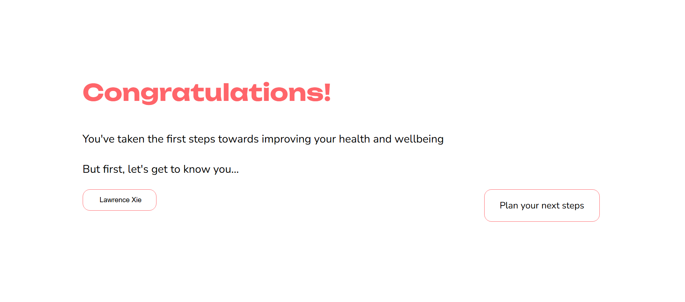
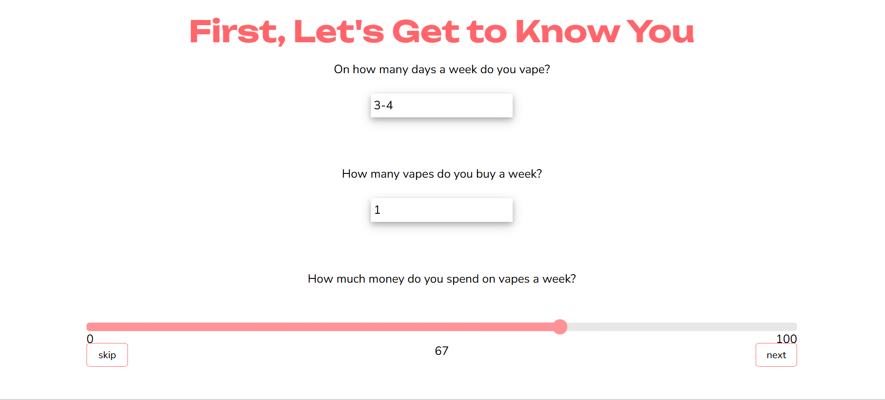

# Vape-pet-hackpeanbot
 
Vape-Pet is a web application submission for the HackBeanPot Hackathon 2025.

The core idea of Vape-Pet is a Harm-Reduction Software that doesn't seek to completely cure the user of their vape or smoking addiction but rather provide a plan of action to slowly reduce the user's vape/smoking usage.

Vape-Pet provides the user with the ability to document and follow their usage, and henceforth allow for self-accountability.
## Frontend Landing Page

Every user is greeted with the two initial pages that asks for the user's name and initialization information.

The third page is the home page that the user consistently refers back to whenever they add a new entry.

<figure>
  
  <figcaption><em>Initialization — user enters name to create their profile.</em></figcaption>
</figure>

<figure>
  
  <figcaption><em>Information Setup — user enters initial vape count.</em></figcaption>
</figure>

<figure>
  
  <figcaption><em>Reminder message — user enters a message as a small reminder.</em></figcaption>
</figure>

<figure>
  
  <figcaption><em>Landing Page — User Home page to count their statistics.</em></figcaption>
</figure>

The home page displays the user's current statistics as well as hold three possible actions for the user to take: Log Entry, Discard Entry, and Record Purchase.

### Log Entry

<figure>
  
  <figcaption><em>Log Entry — User submits information regarding an entry.</em></figcaption>
</figure>

Log entry allows the user to record whenever they use a vape that they purchased. It allows for the user to input whatever they feel after vaping in a quantifiable way.

<figure>
  
  <figcaption><em>Purchase Record — User records vape purchase.</em></figcaption>
</figure>

<figure>
  
  <figcaption><em>Discard Entry — User records vape discard.</em></figcaption>
</figure>

Record Purchase and Discard Entry are twofold operations.

Record Purchase sets up a mark on the timeline of the user. Discard Entry finishes the mark on said timeline. The purpose of those two buttons is to allow the user to create a comphrehensive timeline of their purchases and discards of their vapes.

## Backend and API routing

When the user submits a username that does not already exist in the database, a corresponding entry with no values is created in the backend database.

<figure>
  
  <figcaption><em>Initial User Object Creation — Upon username submission, a corresponding object is created for the user.</em></figcaption>
</figure>

<figure>
  
  <figcaption><em>Log Entry MongoDB — Creation of the energy-mood-object once a log entry has been submitted.</em></figcaption>
</figure>

All entries such as Log Entry, Discard Entry, and Record Purchase are stored as quantifiable sub-documents within each user document for ease of access and encapsulation.

<figure>
  
  <figcaption><em>Timeline Entry MongoDB — The creation of the twostep mark in the user's timeline.</em></figcaption>
</figure>

Discard Entry only works after Record Purchase has been used. Record Purchase sets up the object representing the current mark in the timeline. Discard Entry finishes and writes the ending timestamp for the current mark in the timeline.